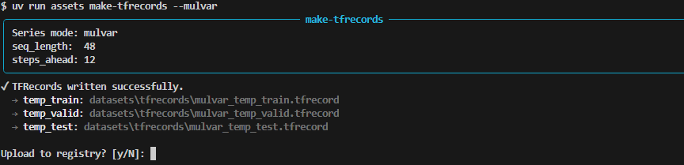
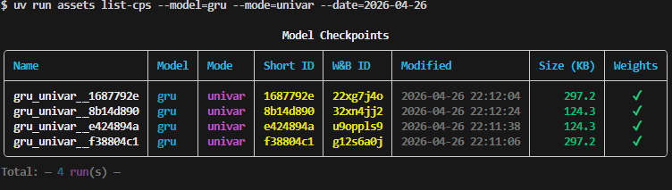
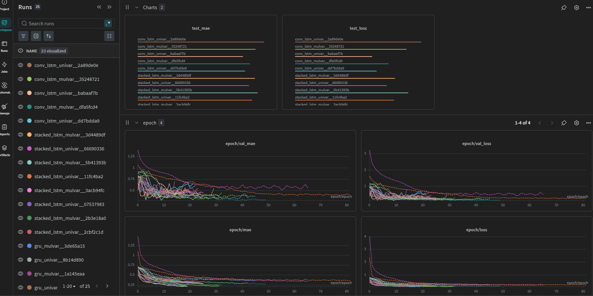
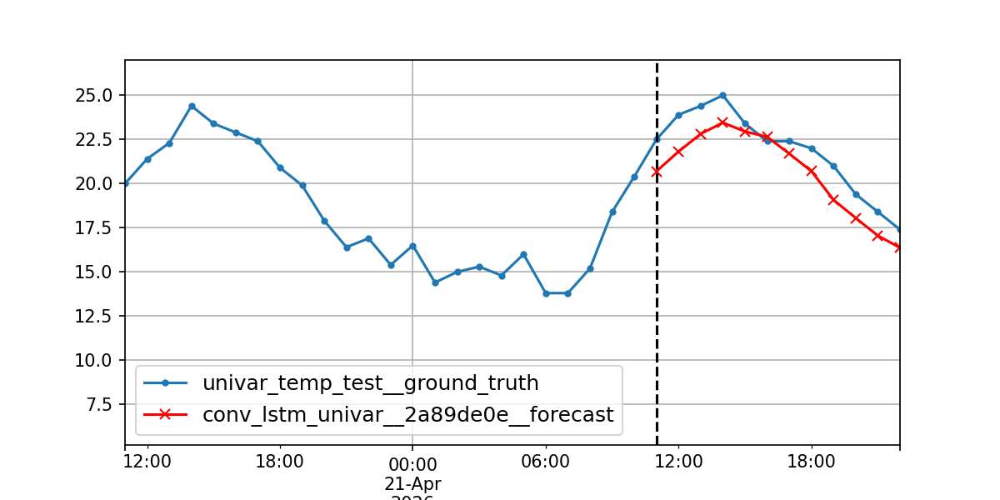

# tempcast

> Deep learning experiment station for weather time-series forecasting,
> powered by Visual Crossing API data.

Tempcast fetches hourly weather data for Greece from the [Visual Crossing](https://www.visualcrossing.com/)
API and trains deep learning models to forecast target weather variables. Experiments are fully configured via [Hydra](https://hydra.cc/), tracked with [Weights & Biases](https://wandb.ai/site/), and managed through a CLI.

A [LangChain](https://www.langchain.com/) agent backed by the W&B MCP server provides natural language analysis of experiment results.

## Features

- **Weather data pipeline** — fetches and incrementally updates hourly weather data from Visual Crossing API, stored as CSV with automatic deduplication
- **TFRecord pipeline** — converts time-series windows into univariate or
  multivariate *TFRecords* for efficient training
- **Multiple architectures** — Driven by Hydra config with no code changes required
- **Experiment tracking** — Weights & Biases integration for metrics, plots,
  and artifact registry with online/offline/disabled modes
- **Resume training** — checkpoint-based resume with epoch tracking and fresh
  optimizer state for warm restarts
- **CLI** — `click` & `rich` interface for data ops, checkpoint inspection, and
  experiment management
- **W&B MCP agent** — LangChain agent with natural language access to
  experiment results via the W&B MCP server

---

### Configuration

Swap models, series mode, or training hyperparameters without touching any code. Examples:

```yaml
# conf/series/univar.yaml
is_mulvar: false
seq_length: 48
steps_ahead: 12
target_col: temp
target_idx: 0
features: [ temp ]
tfrecord_dir: datasets/tfrecords
```

```yaml
# conf/model/conv_lstm.yaml
_target_: tempcast.models.ConvLSTMForecaster

arch:
  name: conv_lstm
  filters: 32
  kernel_size: 3
  pool_size: 2
  units: [ 64, 32 ]
  dropout: 0.2
  recurrent_dropout: 0.1
  activation: relu

training:
  optimizer: adam
  lr: 0.001
  epochs: 100
  batch_size: 32
  early_stopping:
    patience: 10
    monitor: val_loss
    min_delta: 0.0001
```
---

### CLI

- #### Get up to date new records via:

```bash
uv run assets update-weather
```
Note that the first time this runs, it creates the data 31 days from today, respecting the free-tier limit.


- #### Create *TFRecords* and upload to W&B registry optionally:




**<u>SIDEBAR:</u>**

Provide the `--upload` flag when wandb mode is either online or offline. Otherwise, giving the `--wandb-mode` option, sets it up automatically.

Can sync anytime offline runs simply by:
```bash
uv run wandb sync [RUNDIR]
```

- #### List available model checkpoints using optionally filtering:




## Runs & Sweeps

Every aspect of a run — model architecture, series mode, training hyperparameters, and W&B logging — is controlled via config overrides at the command line.



### single-run with overrides

```bash
# overrides:
tempcast series=mulvar model=gru \
    model.arch.units=[128,64,32] \
    model.training.lr=0.003

# enable wandb-logging
tempcast wandb.mode=online
```

### sweeps

```bash
# sweep: w/ wandb-logging:
tempcast --multirun \
  wandb.mode=online
  series=univar,mulvar \
  model=,gru,conv_lstm \
  model.training.lr=0.001,0.0001 \
```

### resumes

```bash
# list available checkpoints
assets list-cps

# resume by short_id
tempcast wandb.mode=online \
    model=gru \
    resume=true \
    ++run_id="a3d163186" \
```

> [!NOTE]
> Resuming loads the best saved weights with a fresh optimizer state,
> acting as a warm restart from the best checkpoint.


### Plots

After each run ```tempcast``` automatically generates a forecast
plot via a hydra-callback — no manual call needed. The plot overlays the
model's forecast against the ground truth test series, with a
vertical dashed line marking the prediction boundary.



Plots are saved to `plots/` and named after the run:
```
plots/
└── conv_lstm_univar__2a89de0e.png
```

### Checkpoints

Each run saves its best weights to a dedicated checkpoint directory named
after the run. Checkpoints are used for resuming training and for generating
forecast plots.

```
checkpoints/
└── conv_lstm_univar__2a89de0e/
    ├── model.weights.h5
    ├── latest_epoch
    └── wandb_run_id
```

## MCP

LangChain agent backed by the [Weights & Biases MCP server](https://docs.wandb.ai/platform/mcp-server) for natural language analysis of experiment results. Ask the agent to compare
runs, find the best configuration, or summarize sweep results.

### middleware

The agent uses a custom `WandbMCPMiddleware` that filters the full MCP tool list down to a curated subset relevant for multirun and sweep analysis,
and registers them dynamically at runtime:

```python
MCP_TOOLS = {
    "query_wandb_tool",
    "probe_project_tool",
    "compare_runs_tool",
    "get_run_history_tool",
    "diagnose_run_tool",
    "summarize_evaluation_tool",
}
```

The middleware intercepts both model calls (`wrap_model_call`) — controlling
which tools the model sees — and tool calls (`wrap_tool_call`) — routing
execution to the correct MCP tool even when tools are registered dynamically.

### example-queries

1) which configuration achieved the lowest test-MAE across all runs?

2) compare stacked_lstm vs gru on mulvar series..
